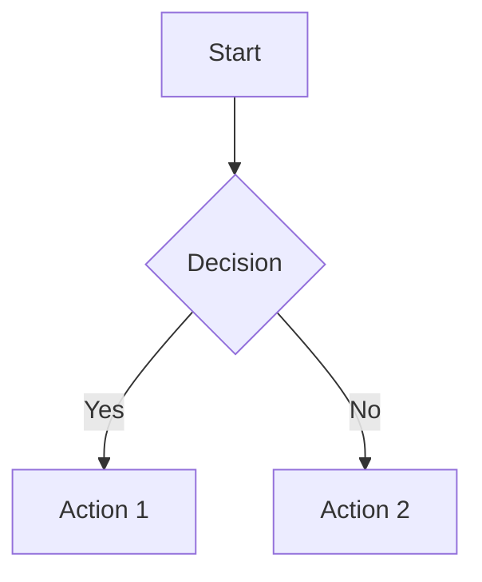

# BeautifulDocs

**Beautiful PDFs, slides & documents from Markdown.** CLI-first, AI-powered, stunning design.

The local, open-source alternative to Gamma.app, Beautiful.ai, and Canva Slides.

```bash
# Install
bun add -g beautifuldocs

# Build PDF from markdown
beautifuldocs build document.md

# Generate with AI
beautifuldocs generate "AI Trends 2026" --format slides --template neon

# Live preview
beautifuldocs watch document.md
```

## ✨ Features

- 🎨 **4 Stunning Templates**: Editorial, Dark Executive, Clean Minimal, Neon Gradient
- 📑 **Auto Table of Contents**: Generated from headings with page numbers
- 📋 **Header/Footer**: Custom text + automatic page numbers
- 📊 **Mermaid Diagrams**: Flowcharts, sequence diagrams, Gantt charts
- 🔗 **QR Codes**: Automatic for URLs in print PDFs
- 🤖 **AI-Powered**: OpenRouter content generation, fal.ai image generation
- 📄 **Multiple Formats**: A4 documents, 16:9 slides, US Letter
- 🎯 **Rich Components**: Cards, metrics, progress bars, callouts
- 💫 **Visual Effects**: Glassmorphism, gradients, glows, patterns
- 🔥 **40+ Icons**: Lucide icons inline with `:icon-name:` syntax
- 🎨 **10 Color Palettes**: Warm, cool, dark, neon themes
- ⚡ **Live Preview**: Watch mode with auto-reload
- 📦 **Batch Processing**: Convert multiple files at once

## 🚀 Quick Start

```bash
# Initialize project
beautifuldocs init my-project
cd my-project

# Edit document.md, then build
beautifuldocs build document.md

# Or generate with AI
beautifuldocs generate "Quarterly Report Q1 2026" --format slides
```

## 📝 Markdown Frontmatter

```yaml
---
title: My Document
template: editorial    # editorial, dark, minimal, neon
format: a4             # a4, 16:9, letter
palette: cream         # See docs for all palettes

# New in v1.1 - Essentials for professional docs
toc: true              # Auto-generate table of contents
header: "Company Confidential"
footer: "© 2026 Company"
pageNumbers: true      # Show page numbers
totalPages: true       # Show "Page X of Y"
---
```

## 🎨 Templates

| Template | Style | Best For |
|----------|-------|----------|
| **Editorial** | Serif + warm tones | Articles, reports, whitepapers |
| **Dark** | Dark bg + gradients | Pitch decks, tech docs |
| **Minimal** | Swiss design | Proposals, clean documents |
| **Neon** | Purple/cyan glows | Modern SaaS, presentations |

## 💻 Commands

| Command | Description |
|---------|-------------|
| `build <file>` | Convert markdown to PDF |
| `generate <topic>` | AI-generate content and PDF |
| `watch <file>` | Live preview with auto-reload |
| `batch <pattern>` | Process multiple files |
| `init [dir]` | Scaffold new project |

## 📊 Mermaid Diagrams

```markdown

```

Supported: flowchart, sequence, class, state, ER, Gantt, pie, mindmap

## 🧩 Components

```markdown
<!-- Cards -->
<div class="card-elevated">
  <h3 class="mt-0">Feature Title</h3>
  <p>Card content here</p>
</div>

<!-- Metrics -->
<div class="metric">
  <div class="metric-value">2.4M</div>
  <div class="metric-label">Users</div>
</div>

<!-- Progress -->
<div class="progress">
  <div class="progress-bar" style="width: 75%"></div>
</div>

<!-- Icons -->
:home: :user: :check: :arrow-right:

<!-- Callouts -->
<div class="callout callout-info">
  <div class="callout-title">:info: Information</div>
  <p>Important info here</p>
</div>
```

## 🔐 Environment Variables

```bash
# For AI features (optional)
export OPENROUTER_API_KEY="sk-or-..."
export FAL_API_KEY="..."
```

## 📦 Installation

```bash
# Via Bun (recommended)
bun add -g beautifuldocs

# Via npm
npm install -g beautifuldocs
```

## 🎯 Examples

### Professional Report with TOC
```markdown
---
title: Annual Report 2026
template: editorial
toc: true
header: "Annual Report"
footer: "Confidential"
pageNumbers: true
---

# Executive Summary

## Financial Highlights
...
```

### Pitch Deck
```markdown
---
title: Pitch Deck
format: 16:9
template: dark
---

# Our Startup

## Problem
...

---

# Solution
...
```

### Technical Documentation
```markdown
---
title: API Documentation
template: minimal
toc: true
---

## Authentication

```http
POST /api/auth
```
```

## 📄 License

MIT © SuperSynergy

[GitHub](https://github.com/Supersynergy/beautifuldocs)
