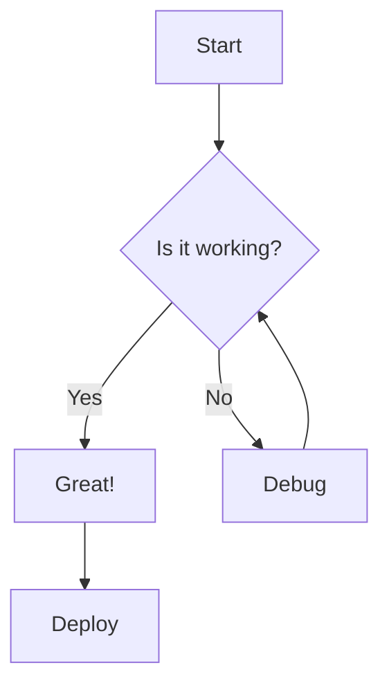

# Complete Feature Demonstration

This document tests all the essential features that everyone needs.

## Table of Contents

The TOC should be auto-generated above this section based on all headings.

## Mermaid Diagram Example



## QR Code Links

Visit our website: https://beautifuldocs.dev

## Components Showcase

<div class="card-elevated">
  <h3 class="mt-0">Feature Card</h3>
  <p>This card has <strong>bold text</strong> and shows the styling.</p>
</div>

### Metrics

<div class="columns-3">
  <div class="metric">
    <div class="metric-value">5</div>
    <div class="metric-label">Phases Complete</div>
  </div>
  <div class="metric">
    <div class="metric-value">4</div>
    <div class="metric-label">Templates</div>
  </div>
  <div class="metric">
    <div class="metric-value">100%</div>
    <div class="metric-label">Awesome</div>
  </div>
</div>

### Progress Bars

<div class="progress-label">
  <span>Implementation</span>
  <span>100%</span>
</div>
<div class="progress">
  <div class="progress-bar" style="width: 100%"></div>
</div>

## Long Content for Multi-Page Test

Lorem ipsum dolor sit amet, consectetur adipiscing elit. Sed do eiusmod tempor incididunt ut labore et dolore magna aliqua.

### Section A

Ut enim ad minim veniam, quis nostrud exercitation ullamco laboris nisi ut aliquip ex ea commodo consequat.

### Section B

Duis aute irure dolor in reprehenderit in voluptate velit esse cillum dolore eu fugiat nulla pariatur.

### Section C

Excepteur sint occaecat cupidatat non proident, sunt in culpa qui officia deserunt mollit anim id est laborum.

## Code Example

```typescript
// This code should have syntax highlighting
interface Config {
  template: string;
  format: 'a4' | '16:9';
}

function build(config: Config): string {
  return `Building with ${config.template}`;
}
```

## Table Example

| Feature | Status | Notes |
|---------|--------|-------|
| TOC | ✅ | Auto-generated |
| Header/Footer | ✅ | With page numbers |
| Mermaid | ✅ | Diagram support |
| QR Codes | ✅ | For URLs |

## Quote

> "The best documentation is the documentation that gets written."
> — Someone Smart

## Conclusion

All features working together!
